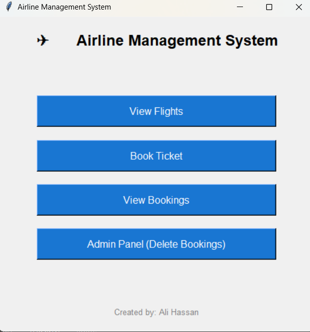
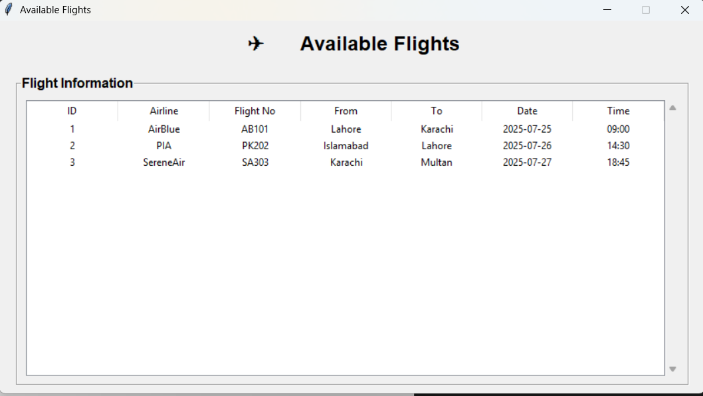
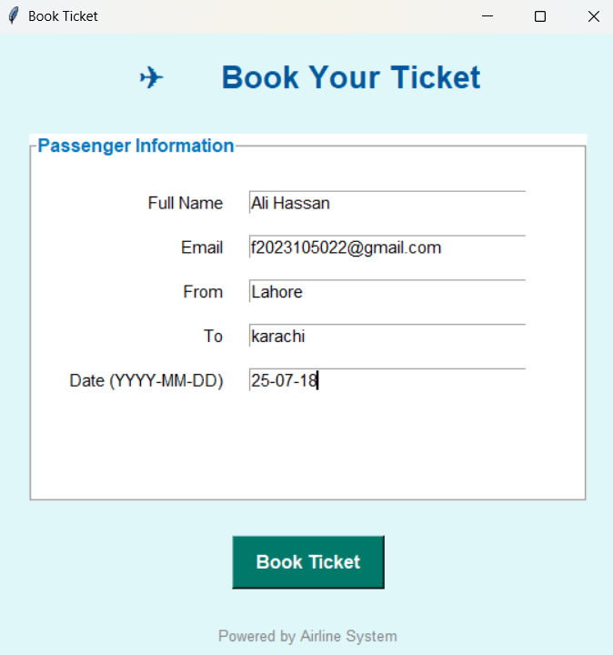
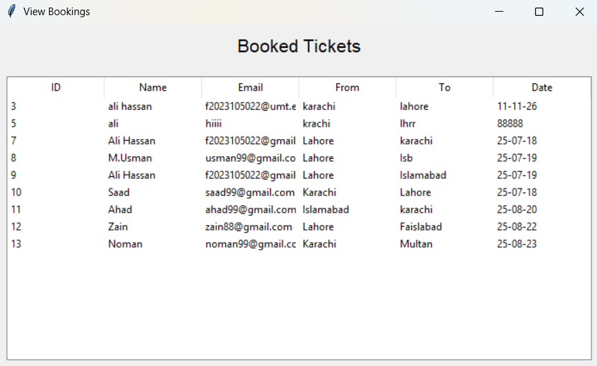
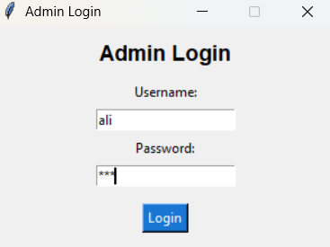
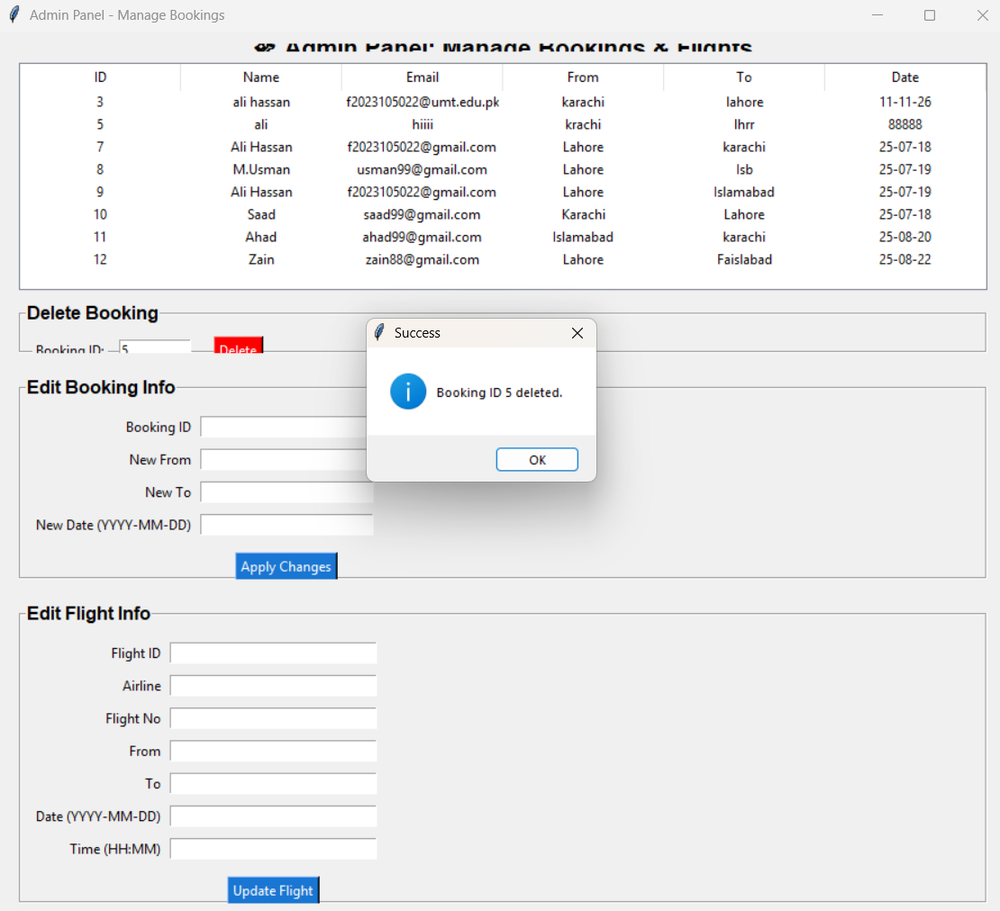
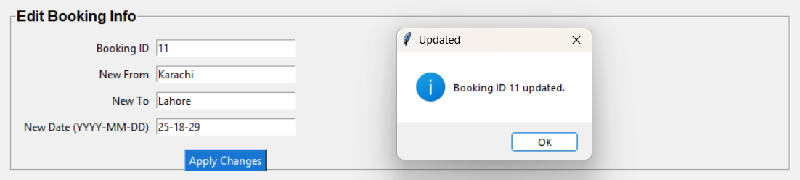

# ✈️ Airline-Management-System  
  
*A modular, offline-first airline ticketing and management tool.*  
**Book smart. Manage smooth. Travel simple.**  

---

## 📌 Project Description  
**Airline-Management-System** is a desktop application built in **Python using Tkinter**, designed to simulate an airline's basic ticketing and flight management process.  
It’s a local-first tool offering essential features like booking tickets, viewing flight data, managing bookings, and running backend operations — ideal for learning CRUD-based GUI systems.  

Whether you're adding flights, managing bookings, or checking passengers — this system keeps airline tasks streamlined and accessible.

---

## ✨ Feature Summary  

| Core Module           | Description                                                            |
|----------------------|------------------------------------------------------------------------|
| 🏠 **Main Dashboard**  | Central window with navigation to all other modules                    |
| 📋 **Book Ticket**     | Form-based module to book flight tickets and store details in database |
| 🔎 **View Bookings**   | Displays all bookings with search/filter/delete functionality          |
| ➕ **Add Flight**       | Admin panel to add flight details (name, number, route, date)         |
| 💾 **SQLite Backend**  | All data is stored locally using SQLite                                |
| 🔒 **Authentication**  | Admin login validation using username/password                         |

---

## 🛠️ Tools & Technologies Used  

| **Layer**              | **Technology Used**                                                  |
|-----------------------|----------------------------------------------------------------------|
| **Programming Language** | Python 3.x                                                       |
| **GUI Framework**      | Tkinter (including `ttk` and `messagebox` for enhanced UI)           |
| **Database**           | SQLite (using the built-in `sqlite3` module)                         |
| **Others**             | Standard Python libraries like `os`, `ttk`, `messagebox`, etc.       |
| **Packaging Tool**     | PyInstaller (to generate a standalone `.exe` executable)             |
| **Version Control**    | Git (for local versioning) and GitHub (for remote collaboration)     |

---

## 🧠 Philosophy: Simple, Local, Educational  

This system was designed with **education**, **modularity**, and **practical usage** in mind.

### 🔒 Offline-First  
Everything runs locally — no server or internet needed.

### 🧩 Modular Architecture  
Each major feature (**booking**, **viewing**, **adding flights**) is isolated into separate pages/files for easier understanding and extension.

### 👩‍💻 Beginner-Friendly Codebase  
Clear naming, straightforward layout management, and organized folder structure make it ideal for new Python GUI developers.

### 💡 Realistic Airline Use Case  
Simulates essential functions an airline clerk or admin would perform in a real-world system.

---
## 🛤️ Roadmap

| **Status** | **Feature**                                                                 |
|------------|------------------------------------------------------------------------------|
| ✅         | **Admin Login System** — Secure login window with validation                 |
| ✅         | **Main Window Navigation** — Links to Book Ticket, Add Flight, and View Bookings |
| ✅         | **Add Flight Module** — Insert flight data into DB                           |
| ✅         | **Book Ticket Module** — Take passenger details and store bookings           |
| ✅         | **View Bookings** — Display, search, and delete booking records              |
| 🔜         | **Flight Availability Checker** — Show available flights by date             |
| 🔜         | **Printable Tickets** — Generate a PDF or print preview after booking        |
| 🔜         | **Sorting & Filtering Bookings** — Filter by flight, date, or passenger name |
| 🔜         | **Admin Panel Enhancements** — Dashboard stats, export data, etc.            |

---
## 🖥️ Interface Preview   
Below are snapshots of working modules. All functionality is live and running in the .py scripts.

### 🏠 Main Window  
- Central navigation screen  
- Buttons to all functional pages: Book Ticket, View Bookings, Add Flight
  


---
### 🛫 Available Flight  
- Input fields for flight number, name, route, and date  
- Data saved directly into SQLite
  


---


### 🎟️ Book Ticket  
- Form to input passenger and flight details  
- Stores data in SQLite and shows success message



---
### 📄 View Bookings  
- Displays all bookings in a scrollable list  
- Option to delete individual bookings  
- Clean and readable layout  




### 🔐 Login Page
- Simple UI with username/password validation  
- Only authenticated access to admin features



---
**ADMIN** can delete **INFO** 



---
**ADMIN** can edit **Passenger INFO**



---

**ADMIN** can edit **Flight INFO**


---

## 🚀 Setup & Run Instructions  

### 🔧 Requirements  
- Python 3.x installed  
- `pip` package manager available  

### 📦 Installation & Execution  
Open your terminal or command prompt and run the following commands:

```bash
git clone https://github.com/Musman3739/Airline-Management-Tkinter.git
cd Airline-Management-Tkinter
pip install -r requirements.txt

# Run the main application
python main.py
---

✅ No internet or external API required — the app is fully local and self-contained.

-----
## 🧩 Codebase Structure
Airline-Management-Tkinter/
│
├── main.py               # Main window with navigation  
├── book_ticket.py        # Book Ticket module  
├── view_bookings.py      # View/Delete bookings  
├── add_flight.py         # Admin flight entry  
├── database.py           # SQLite logic  
└── airline.db            # SQLite database file  
---


